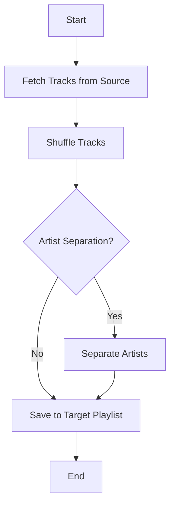
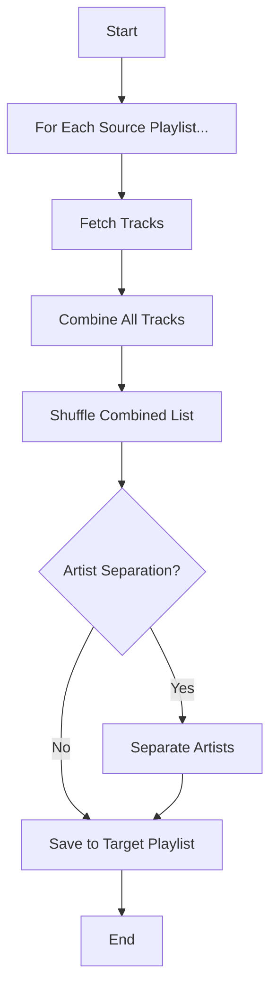
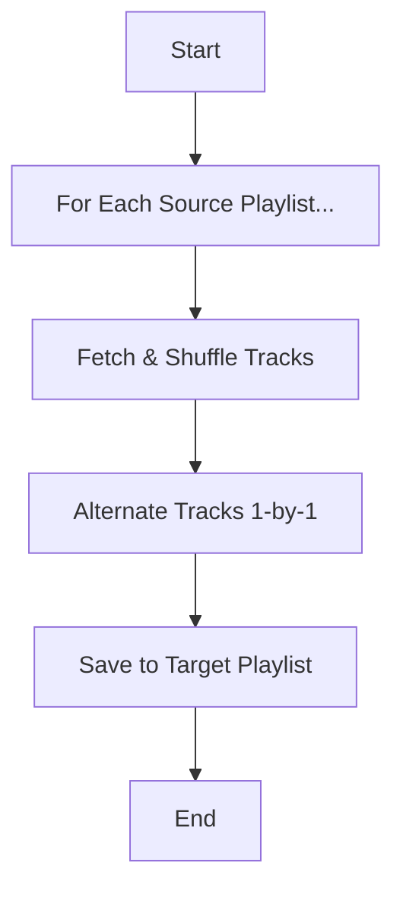
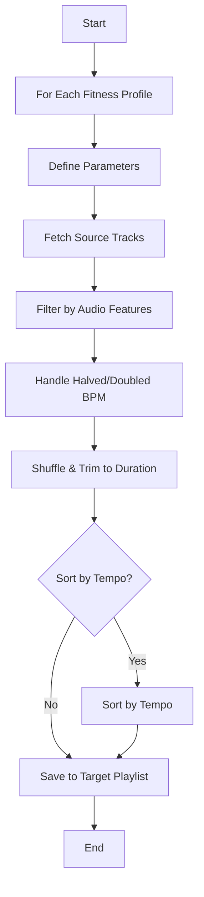
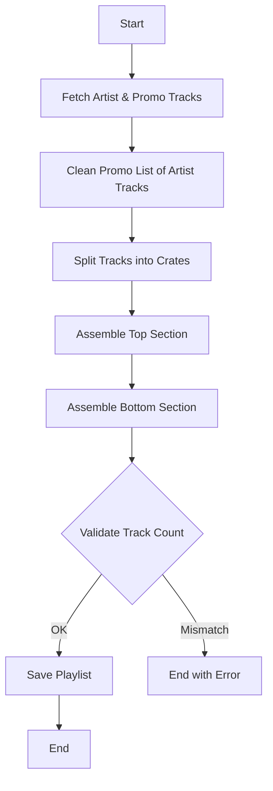
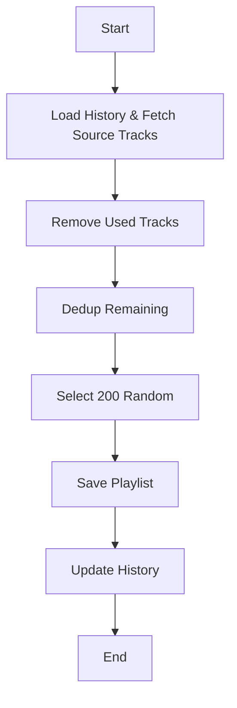
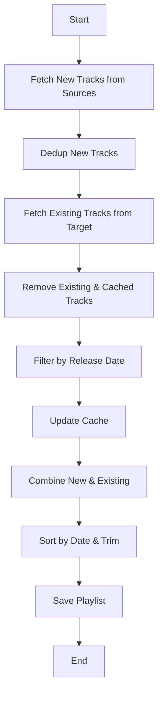

# Spotify Automation for Google Apps Script

## 1. Introduction and Purpose

This project is a collection of Google Apps Script modules designed to automate the management of Spotify playlists and artist catalogs. It provides a powerful, serverless framework for creating dynamic, rule-based playlists, syncing artist discographies to Google Sheets, and keeping playlists fresh with new releases. It leverages the Goofy library for Spotify API interactions.

## 2. Setup and Configuration

### Google Apps Script Environment
1.  **Create a Project:** Start a new project on [script.google.com](https://script.google.com).
2.  **Local Development (Recommended):** Use Google's `clasp` command-line tool to manage your project files locally. This allows you to use your preferred code editor and version control system like `git`.
3.  **Add Libraries:** In the GAS editor, go to `Project Settings > Libraries` and add the following libraries using their script IDs:
    *   **OAuth2:** `1B7FSrk57A1B1Ld32VGM55wjZkO0MbjStR-g10ltxBE_cSA2vT_z7_dJA` (For handling Spotify API authentication).
    *   **Cheerio:** `1ReeQ6WO8kKNxoaA_O0XEQ589cIrRvEBA9qcWpNqdOP17i47u6N9M5Xh0` (For parsing HTML, used by the Everynoise scripts).

### Configuration
*   **Artist Catalog `ControlSheet`:** The `syncAllArtistCatalogs` function is configured via a Google Sheet (the URL is hardcoded in `gas/artist_catalog.gs`). This sheet must have a tab named `ControlSheet` with the following columns:
    *   `Enabled`: A checkbox. If checked (`TRUE`), the script will sync the artist in that row.
    *   `Artist Name`: The name of the artist (for logging purposes).
    *   `Artist URI`: The full Spotify URI for the artist (e.g., `spotify:artist:xxxxxxxx`).
    *   `Sheet URL`: The URL of the Google Sheet where the catalog will be stored.
    *   `Catalog Sheet Name`: The specific name of the tab (sheet) to use within the destination spreadsheet.
    *   `Report Email`: The email address where the sync report will be sent.
    *   `Force Update`: A checkbox. If checked (`TRUE`), the script will overwrite any data mismatches in the sheet with the data from Spotify. If unchecked, it will only report mismatches.
*   **Playlist Script Configuration:** Most playlist scripts are configured by editing the parameters directly within their respective trigger functions (e.g., `organisePlaylists`, `runArtistPromoUpdate`). You will need to replace the hardcoded playlist IDs with your own.

## 3. Artist Catalog Management (`artist_catalog.gs`)

This script provides a robust solution for syncing an artist's complete Spotify catalog to a Google Sheet.

*   **Trigger:** `syncAllArtistCatalogs()`
*   **Detailed Workflow:**
    1.  The script reads the configuration from the `ControlSheet`.
    2.  For each enabled artist, it fetches all tracks from the Spotify API, including albums, singles, compilations, and "appears_on" tracks.
    3.  It reads all existing data from the destination Google Sheet, using the ISRC (International Standard Recording Code) as the unique identifier for each track.
    4.  It performs a sophisticated data reconciliation:
        *   **New Tracks:** If a track's ISRC from Spotify does not exist in the sheet, it's added as a new row.
        *   **Data Updates:** Fields like `Release Date`, `Duration`, and `Genre` are silently updated to match Spotify's data. Changes to `Popularity` and `Availability` (in the user's market) are tracked and included in the report.
        *   **Mismatch Handling:** If the `Force Update` box is unchecked, the script will report any discrepancies between your sheet and Spotify's data (e.g., a different `Label` or `UPC`) but will **not** change your data. If `Force Update` is checked, it will overwrite your sheet's data with Spotify's data for those fields.
        *   **ISRC-based Logic:** The entire sync process is based on ISRC, which makes it resilient to changes in Spotify's track IDs that can occur due to re-linking.
    5.  After the sync, a detailed HTML email report is sent, summarizing all changes.
*   **Email Report Breakdown:**
    *   **New Tracks Found:** A list of all new songs added to the sheet.
    *   **Artist Genre Change:** Notifies if the artist's primary genre on Spotify has changed.
    *   **Availability Status Changes:** Lists tracks that have become available or unavailable in your market.
    *   **Popularity Score Updates:** Shows changes in the popularity score for each track.
    *   **Missing Information Filled:** Reports when the script has filled in blank cells in your sheet.
    *   **Data Mismatches:** Details any discrepancies found (and whether they were overwritten, based on the `Force Update` setting).
    *   **Tracks in Sheet Not Found on Spotify:** Lists any tracks that were in your sheet but could not be found via the Spotify API using their ISRC.

## 4. Playlist Management: Types and Usage

### Simple Shuffling, Aggregation, and Alternating (`playlists_simple.gs`)
The `organisePlaylists()` trigger runs a series of pre-configured playlist tasks.

*   **How to use:** Edit the `organisePlaylists` function in `gas/playlists_simple.gs`. Inside the `main()` function, you will find calls to `shufflePlaylist`, `aggregatePlaylists`, and `alternatePlaylists`. Modify the parameters in these calls to match your needs.
    *   **`shufflePlaylist({ name, description, sourceid, targetid, separation })`**: Shuffles a source playlist. If `targetid` is provided, it saves to a new playlist; otherwise, it shuffles in-place. `separation` enforces a minimum number of tracks between songs by the same artist.
    *   **`aggregatePlaylists({ name, description, playlists, targetid, separation })`**: Combines all tracks from an array of `playlists` (by ID) into a single large playlist, which is then shuffled.
    *   **`alternatePlaylists({ name, description, playlists, targetid, separation, toLimitOn })`**: Creates a new playlist by alternating tracks from an array of source `playlists`.

<details>
<summary>Click to view Workflow Diagrams</summary>

#### `shufflePlaylist` Workflow


#### `aggregatePlaylists` Workflow


#### `alternatePlaylists` Workflow

</details>

### Complex Rule-Based Creation (`playlists_complex.gs`)
These functions create highly specific, niche playlists. To use them, edit the hardcoded playlist IDs and parameters within each function.

*   **`createMelatone()` & `createBackToSleep()`:** Create short, calming instrumental playlists for relaxation and sleep by pulling random tracks from curated source playlists.
*   **`createLatinPartyMix()`:** Builds a dynamic party playlist by alternating Cumbia, Salsa, Bachata, and Merengue, filtering out tracks that are too short or too long.
*   **`createBachataSalsaCumbia()`:** Creates a 150-track daily playlist following a strict `BSBSBC` (Bachata/Salsa/Bachata/Salsa/Bachata/Cumbia) pattern.
*   **`createFitnessPlaylists()`:** Generates playlists for running (180 BPM) and cycling (80 RPM) by filtering source playlists based on a target BPM and audio features like energy and danceability.

<details>
<summary>Click to view `createFitnessPlaylists` Workflow Diagram</summary>


</details>

### Promotional Playlist Creation (`playlist_artistpromo.gs`)
This script is a powerful tool for artists to create a dynamic playlist that strategically showcases their music.

*   **Trigger:** `runArtistPromoUpdate()`
*   **How it Works:** The script uses a three-playlist system:
    1.  **The Artist Playlist:** Contains only your own tracks. The first three are treated as top priority.
    2.  **The Promo Playlist:** A hand-picked collection of tracks from other artists you want to be associated with.
    3.  **The Combined Playlist:** The final, public-facing playlist. The script starts it with a popular track, weaves your top 3 tracks into the beginning, and then intelligently distributes the rest of your music throughout the remainder of the playlist.
*   **How to use:** Edit the `runArtistPromoUpdate` function. The `createArtistPromoPlaylist` function now accepts an optional second parameter, `extraInterval` (an integer from 0-9), which increases the number of promotional tracks in the playlist.
    ```javascript
    const playlistConfig1 = {
      artistPlaylist: { id: 'YOUR_ARTIST_PLAYLIST_ID', name: 'Your Artist Playlist Name' },
      promoPlaylist: { id: 'YOUR_PROMO_PLAYLIST_ID', name: 'Your Promo Playlist Name' },
      combinedPlaylist: { id: 'YOUR_COMBINED_PLAYLIST_ID', name: 'Your Final Playlist Name' },
    };
    // This call uses the default interval.
    createArtistPromoPlaylist(playlistConfig1, 0);

    // This call adds 2 extra promo tracks at each insertion point.
    createArtistPromoPlaylist(playlistConfig2, 2);
    ```
*   **Strategy & SEO:** The script's original documentation includes a detailed guide on optimizing your playlist's title, description, and cover art for discovery on Spotify, including AI prompts to help brainstorm assets. This information has been preserved in `gas/playlist_artistpromo.md`.

<details>
<summary>Click to view Workflow Diagram</summary>


</details>

### Daily History-Based Playlist (`playlists_history.gs`)
*   **Trigger:** `createAujourdhui()`
*   **What it does:** Creates a daily playlist named "La playlist d'aujourd'hui" by pulling 200 random tracks from several large source playlists.
*   **How it works:** It uses a JSON file (`aujourdhui.json`) to store the tracks from the last 6 days, ensuring that no track is repeated within that period.

<details>
<summary>Click to view Workflow Diagram</summary>


</details>

### New Release Playlists
*   **Everynoise (`playlists_everynoise.gs`, `playlists_chillhop.gs`):**
    *   **Triggers:** `everynoiseWeeklyReleases()`, `everynoiseNewChillVibes()`
    *   **Note:** These scripts use the now-defunct `everynoise.com` website to discover new releases. They are preserved for reference but are no longer functional.
*   **Particle Detector (`playlist_particledetector.gs`):**
    *   **Trigger:** `ParticleDetector()`
    *   **What it does:** As a successor to Everynoise, this script uses Spotify's own "The Pulse of..." and "The Edge of..." playlists to discover and add new releases to genre-specific tracker playlists.

<details>
<summary>Click to view Workflow Diagram</summary>


</details>

### ZipDJ Workbench Utility (`playlists_zipdj.gs`)
*   **Function:** `zipdjClassicTracks()`
*   **What it does:** This is a utility script for curators. It identifies popular tracks from a source playlist that have not yet been added to a master archive and stages them in a "workbench" playlist for review.

## 5. List of All Managed Spotify Playlists

| Playlist Name                               | Playlist ID                     | Governing Script                | How It's Managed                                                                      |
| ------------------------------------------- | ------------------------------- | ------------------------------- | ------------------------------------------------------------------------------------- |
| [`☆ Bachata Sensual ☆`](https://open.spotify.com/playlist/1nqbNlWFz4hp17Ynn6iquL) | `1nqbNlWFz4hp17Ynn6iquL`         | `playlists_simple.gs`           | Daily shuffle of a source playlist with artist separation.                            |
| [`☆ Bachata Dominicana ☆`](https://open.spotify.com/playlist/6dmOgyY7Tb7c8omYe1j5y4) | `6dmOgyY7Tb7c8omYe1j5y4`         | `playlists_simple.gs`           | Daily shuffle of a source playlist with artist separation.                            |
| [`★ Chansons françaises ★`](https://open.spotify.com/playlist/7dH9IZblZHHaTU093MIt8v) | `7dH9IZblZHHaTU093MIt8v`         | `playlists_simple.gs`           | Daily shuffle of a source playlist with artist separation.                            |
| [`Cumbia`](https://open.spotify.com/playlist/7htbYn8f0q01n5br4XhQR9) | `7htbYn8f0q01n5br4XhQR9`         | `playlists_simple.gs`           | Daily shuffle of a source playlist with artist separation.                            |
| [`Merengue`](https://open.spotify.com/playlist/3Bsz7QecNExg8bsDdW4iGW) | `3Bsz7QecNExg8bsDdW4iGW`         | `playlists_simple.gs`           | Daily shuffle of a source playlist with artist separation.                            |
| [`☆ Reggaeton ☆`](https://open.spotify.com/playlist/6xkeo6Oz8VT1MhJ3nExVlE) | `6xkeo6Oz8VT1MhJ3nExVlE`         | `playlists_simple.gs`           | Daily shuffle of a source playlist.                                                   |
| [`★ Reggae du jour ★`](https://open.spotify.com/playlist/6kmna7mjnECJ2CV3XQYR2x) | `6kmna7mjnECJ2CV3XQYR2x`         | `playlists_simple.gs`           | Daily refresh with 25 new random tracks from a source.                                |
| [`♡ Romance en plusieurs langues ♡`](https://open.spotify.com/playlist/6jcCwqV6X2iVrurEcmN1hf) | `6jcCwqV6X2iVrurEcmN1hf`         | `playlists_simple.gs`           | Daily shuffle of a source playlist with artist separation.                            |
| [`Salsa`](https://open.spotify.com/playlist/0o2GXyncPfGLmGSiOqSINx) | `0o2GXyncPfGLmGSiOqSINx`         | `playlists_simple.gs`           | Daily shuffle of a source playlist with artist separation.                            |
| [`★ Soulful Rock ★`](https://open.spotify.com/playlist/6s6sB82xc8GIrtzo4OIz9N) | `6s6sB82xc8GIrtzo4OIz9N`         | `playlists_simple.gs`           | Daily shuffle of a source playlist with artist separation.                            |
| [`nws - influence`](https://open.spotify.com/playlist/1NBSk4KnLzpqXlOjl6bcJP) | `1NBSk4KnLzpqXlOjl6bcJP`         | `playlists_simple.gs`           | Alternates tracks from 6 different chill/ambient source playlists.                  |
| [`Bachata`](https://open.spotify.com/playlist/7eufyawBpqQMvsIN4fgQB1) | `7eufyawBpqQMvsIN4fgQB1`         | `playlists_simple.gs`           | Alternates tracks from a modern and a traditional bachata playlist.                 |
| [`Salsa vs Bachata`](https://open.spotify.com/playlist/27eKRcsYJrHfsP5px09NuR) | `27eKRcsYJrHfsP5px09NuR`         | `playlists_simple.gs`           | Alternates tracks from a combined Bachata and a shuffled Salsa playlist.            |
| [`[all english]`](https://open.spotify.com/playlist/3XWhltPcZYDWq6MA7H7UvI) | `3XWhltPcZYDWq6MA7H7UvI`         | `playlists_simple.gs`           | Aggregates tracks from multiple genre-specific playlists into one large shuffled list.|
| [`[all latin]`](https://open.spotify.com/playlist/1WFP39vejsXR3BTPfOGXDS) | `1WFP39vejsXR3BTPfOGXDS`         | `playlists_simple.gs`           | Aggregates tracks from multiple genre-specific playlists into one large shuffled list.|
| [`Melatone`](https://open.spotify.com/playlist/6b4w2n49x7eVcYu3s90pCN) | `6b4w2n49x7eVcYu3s90pCN`         | `playlists_complex.gs`          | Creates a short, relaxing playlist from 3 different "Melatone" source lists.        |
| [`Back to sleep`](https://open.spotify.com/playlist/0PYcAZ0kdV5wyjynCcGzIR) | `0PYcAZ0kdV5wyjynCcGzIR`         | `playlists_complex.gs`          | Creates a very short playlist for falling back asleep.                                |
| [`Latin party mix`](https://open.spotify.com/playlist/672FuqsErGsxloQTpjbXYq) | `672FuqsErGsxloQTpjbXYq`         | `playlists_complex.gs`          | Alternates Cumbia, Salsa, Bachata, Merengue, filtering by track duration.           |
| [`★ Bachata vs Salsa vs Cumbia ★`](https://open.spotify.com/playlist/2i86j69ApMQVL6Fi4oQ1H0) | `2i86j69ApMQVL6Fi4oQ1H0`         | `playlists_complex.gs`          | Creates a 150-track playlist following a strict BSBSBC pattern.                     |
| [`Running 180 bpm`](https://open.spotify.com/playlist/3ObKrWDdeEAcO7RxWRMItj) | `3ObKrWDdeEAcO7RxWRMItj`         | `playlists_complex.gs`          | Generates fitness playlists by filtering source tracks by BPM and audio features.     |
| [`Cycling 80 rpm`](https://open.spotify.com/playlist/3ILZOMnYvRpifSc6By5WfG) | `3ILZOMnYvRpifSc6By5WfG`         | `playlists_complex.gs`          | Generates fitness playlists by filtering source tracks by BPM and audio features.     |
| [`Fitness 120 bpm`](https://open.spotify.com/playlist/3V6pdBEtDLx49Oz6AYxIQ1) | `3V6pdBEtDLx49Oz6AYxIQ1`         | `playlists_complex.gs`          | Generates fitness playlists by filtering source tracks by BPM and audio features.     |
| [`🌿🧘 Relax and Focus...`](https://open.spotify.com/playlist/3fDrMMM2stMDiatj729xQM) | `3fDrMMM2stMDiatj729xQM`         | `playlist_artistpromo.gs`       | A promotional playlist combining an artist's tracks with other popular tracks.        |
| [`Café Con Leche: A Latin Music Blend`](https://open.spotify.com/playlist/1Vx895NFNT4O1S5QeSDpRU) | `1Vx895NFNT4O1S5QeSDpRU`         | `playlist_artistpromo.gs`       | A promotional playlist combining an artist's tracks with other popular tracks.        |
| [`La playlist d'aujourd'hui`](https://open.spotify.com/playlist/2X3iP4naAyWlgIaIC5vbSB) | `2X3iP4naAyWlgIaIC5vbSB`         | `playlists_history.gs`          | A daily playlist of 200 random tracks with a 6-day history to prevent repeats.      |
| [`everynoise salsa`](https://open.spotify.com/playlist/2vFImomKbig2xPmEngiFAH) | `2vFImomKbig2xPmEngiFAH`         | `playlists_everynoise.gs`       | (Legacy) Weekly updated playlist with new releases sourced from everynoise.com.     |
| [`everynoise bachata`](https://open.spotify.com/playlist/6f4LjtkW7i95IB0Pvo0tmC) | `6f4LjtkW7i95IB0Pvo0tmC`         | `playlists_everynoise.gs`       | (Legacy) Weekly updated playlist with new releases sourced from everynoise.com.     |
| [`everynoise merengue`](https://open.spotify.com/playlist/1l11F6ffJJYWJUfD3yVm5V) | `1l11F6ffJJYWJUfD3yVm5V`         | `playlists_everynoise.gs`       | (Legacy) Weekly updated playlist with new releases sourced from everynoise.com.     |
| [`everynoise cumbia`](https://open.spotify.com/playlist/5OvN1nZ7z8Z8iwiUSGburb) | `5OvN1nZ7z8Z8iwiUSGburb`         | `playlists_everynoise.gs`       | (Legacy) Weekly updated playlist with new releases sourced from everynoise.com.     |
| [`* LATEST NEW CHILL VIBES *`](https://open.spotify.com/playlist/09FTQOXMEXdKuZHBsNYW8f) | `09FTQOXMEXdKuZHBsNYW8f`         | `playlists_chillhop.gs`         | (Legacy) Weekly updated playlist with new chill/hip-hop releases from everynoise.com. |
| `everynoise cumbia` (Particle Detector)     | `5OvN1nZ7z8Z8iwiUSGburb`         | `playlist_particledetector.gs`  | Updated with new releases from Spotify's "Pulse of Cumbia" and "Edge of Cumbia".    |
| `[zipdj] workbench`                         | `1uLOtPdWnESn9zbgzzZDlh`         | `playlists_zipdj.gs`            | A temporary playlist for staging popular, un-archived tracks for review.            |

## 6. Script and Trigger Reference

| Script File                      | Primary Trigger/Function          | Purpose                                                              |
| -------------------------------- | --------------------------------- | -------------------------------------------------------------------- |
| `library.gs`                     | `runTasks_()`                     | Core library; updates cached data for recent/saved tracks.           |
| `artist_catalog.gs`              | `syncAllArtistCatalogs()`         | Syncs artist catalogs to Google Sheets based on a control sheet.     |
| `playlist_artistpromo.gs`        | `runArtistPromoUpdate()`          | Creates and updates sophisticated artist promotional playlists.      |
| `playlists_simple.gs`            | `organisePlaylists()`             | Runs all simple shuffle, aggregation, and alternating playlist tasks.|
| `playlists_complex.gs`           | `create...()` functions           | Each function creates a specific, complex, rule-based playlist.      |
| `playlists_history.gs`           | `createAujourdhui()`              | Creates a daily playlist with a history to prevent repeats.          |
| `playlists_everynoise.gs`        | `everynoiseWeeklyReleases()`      | (Legacy) Fetches new Latin releases from everynoise.com.             |
| `playlists_chillhop.gs`          | `everynoiseNewChillVibes()`       | (Legacy) Fetches new chill/hip-hop releases from everynoise.com.     |
| `playlist_particledetector.gs`   | `ParticleDetector()`              | Fetches new releases from Spotify's "Particle Detector" playlists.   |
| `playlists_zipdj.gs`             | `zipdjClassicTracks()`            | A utility function for curating tracks for an archive.               |
